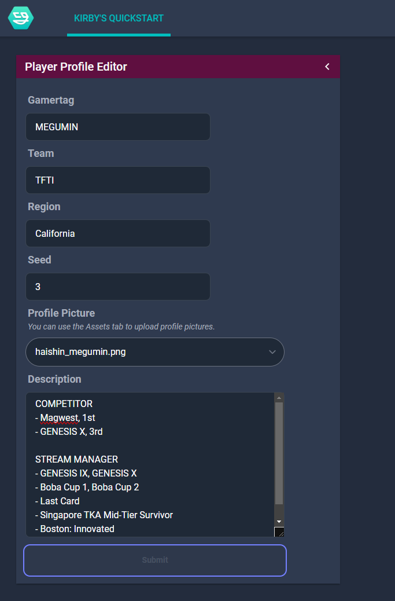
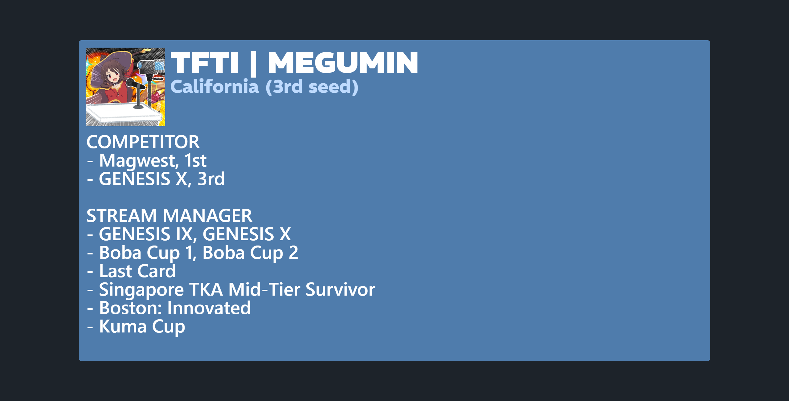

# Player Profile Viewer
This bundle displays a player's profile and biography on a browser source. It's a starter bundle demonstrating how to use NodeCG and quickstart projects of your own. It is based off [resir014's NodeCG Quickstart project](https://github.com/resir014/nodecg-react-typescript-tailwind-quickstart).

This bundle demonstrates the following features:
- A custom replicant with schema validation
- Custom assets (uploading a player's profile picture)
- Using nodecg's hook `useReplicant` to retrieve the replicant
- Importing images, adding Google fonts, and using TailwindCSS with DaisyUI

## Preview




### Prerequisites
- Git
- Node v18 or higher
- nodecg >=2.0.0
- pnpm (preferred)

## Getting Started
After installing nodecg, install the bundle by cloning the repository directly in the bundles directory.

```
cd bundles
git clone https://github.com/starrodkirby86/player-profile-viewer
cd player-profile-viewer
pnpm i
```

### How To Use
In order for the bundle to be seen by NodeCG, the project must build the React components into dashboard and graphics files.

```
pnpm build
```

For development, use the `watch` command.
```
pnpm watch
```

## Acknowledgements
- [**resir014's amazing quickstart repository**](https://github.com/resir014/nodecg-react-typescript-tailwind-quickstart). It was the only starters' template that I was able to rapidly develop bundles in a stack I was comfortable with.
- **The DDR community**. For letting me develop exciting visuals and scenes to help push the competitive scene forward.